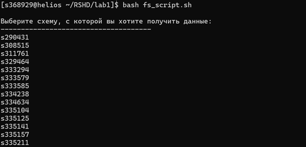
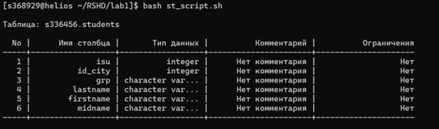

# Distributed Storage Systems Course | Lab 1 | Tupichenko Mila | P3309

## Задание

Используя сведения из системных каталогов, получить информацию о любой таблице: Номер по порядку, Имя столбца,
Атрибуты (в атрибуты столбца включить тип данных, комментарий, ограничение целостности типа NOT NULL).

    Таблица: Н_УЧЕНИКИ

    No. Имя столбца 		Атрибуты
    --- ----------------- ------------------------------------------------------

    1	ИД			Type:		NUMBER(9)
                                    COMMEN:		Уникальный идентификатор
                                    Constraint:	УЧЕН_PK  Primary key
    2	ЧЛВК_ИД	                Type:		NUMBER(9)
                                    COMMEN:		Внешний ключ к таблице Н_ОБУЧЕНИЯ
    3	ПРИЗНАК		        Type:		VARCHAR2(10)
                                    COMMEN:		(обучен,отчисл,академ,диплом)
    4	СОСТОЯНИЕ	        Type:		VARCHAR2(9)
                                    COMMEN:		Состояние (проект, утвержден, отменен)
    5	НАЧАЛО		        Type:		DATE Not null
    6	КОНЕЦ		        Type:		DATE Not null
    7	ПЛАН_ИД		        Type:		NUMBER(9)
                                    COMMEN:		Искусственный первичный уникальный идентификатор
    8	ГРУППА			Type:		VARCHAR2(4)
                                    COMMEN:		Номер студенческой группы
    9	П_ПРКОК_ИД		Type:		NUMBER(9)
                                    COMMEN:		Внешний ключ к таблице Н_ПУНКТЫ_ПРИКАЗОВ_ОК
    10	ВИД_ОБУЧ_ИД		Type:		NUMBER(9)
                                    COMMEN:		Внешний ключ к таблице Н_ОБУЧЕНИЯ
    11	ПРИМЕЧАНИЕ		Type:		VARCHAR2(200)
                                    COMMEN:		Текст примечания
    12	КТО_СОЗДАЛ		Type:		VARCHAR2(40)
    13	КОГДА_СОЗДАЛ		Type:		DATE Not null
    14	КТО_ИЗМЕНИЛ		Type:		VARCHAR2(40)
    15	КОГДА_ИЗМЕНИЛ		Type:		DATE Not null
    16	КОНЕЦ_ПО_ПРИКАЗУ	Type:		DATE
                                    COMMEN:		конец периода действия строки по приказу
    17	ВМЕСТО			Type:		NUMBER(9)
                                    COMMEN:		ссылка на строку, вместо которой введена текущая
    18	В_СВЯЗИ_С		Type:		NUMBER(9)
                                    COMMEN:		ид начисления, вызвавшего изменение текущего атрибута конец
    19	ТЕКСТ			Type:		VARCHAR2(200)

Программу оформить в виде анонимного блока.

## Код основных функций

```find_schemas.sql``` - анонимный блок, который проверяет наличие таблицы с именем students(или любой заданной) в
различных схемах базы данных и выводит информацию о найденных схемах.

```postgresql
DO
$$
    DECLARE
        target_table TEXT := 'students';
        schema_rec   RECORD;
        table_count  INT;
    BEGIN
        SELECT COUNT(DISTINCT n.nspname)
        INTO table_count
        FROM pg_class c
                 JOIN pg_namespace n ON c.relnamespace = n.oid
        WHERE c.relname = target_table;

        IF table_count < 1 THEN
            RAISE EXCEPTION 'Таблица "%" не найдена!', target_table;
        ELSE
            RAISE NOTICE ' ';
            RAISE NOTICE 'Выберите схему, с которой вы хотите получить данные:';
            RAISE NOTICE '-------------------------------------';

            FOR schema_rec IN
                SELECT DISTINCT n.nspname AS schema_name
                FROM pg_class c
                         JOIN pg_namespace n ON c.relnamespace = n.oid
                WHERE c.relname = target_table
                ORDER BY n.nspname
                LOOP
                    RAISE NOTICE '%', schema_rec.schema_name;
                END LOOP;

            RAISE NOTICE '-------------------------------------';
            RAISE NOTICE 'Всего найдено схем: %', table_count;
            RAISE NOTICE ' ';
        END IF;
    END
$$ LANGUAGE plpgsql;
```

```show_columns.sql``` - анонимный блок, который создает форматированный отчет о структуре таблицы ```table_name``` в схеме ```schema_name```, который содержит:

- Номер столбца
- Имя столбца
- Тип данных
- Комментарий
- Ограничения

```postgresql

DO
$$
    DECLARE
        target_table  TEXT := 'students';
        target_schema TEXT := 's336456';
        col_rec       RECORD;
        header        TEXT;
        divider       TEXT;
        output_line   TEXT;
    BEGIN
        header := lpad('No', 4) || ' | ' ||
                  lpad('Имя столбца', 16) || ' | ' ||
                  lpad('Тип данных', 16) || ' | ' ||
                  lpad('Комментарий', 20) || ' | ' ||
                  lpad('Ограничения', 20);

        divider := lpad('', 4, '-') || '-+-' ||
                   lpad('', 16, '-') || '-+-' ||
                   lpad('', 16, '-') || '-+-' ||
                   lpad('', 20, '-') || '-+-' ||
                   lpad('', 20, '-');

        RAISE NOTICE ' ';
        RAISE NOTICE 'Таблица: %.%', target_schema, target_table;
        RAISE NOTICE ' ';
        RAISE NOTICE '%', header;
        RAISE NOTICE '%', divider;

        FOR col_rec IN
            SELECT row_number() OVER ()                       AS no,
                   a.attname                                  AS column_name,
                   format_type(a.atttypid, a.atttypmod)       AS data_type,
                   COALESCE(d.description, 'Нет комментария') AS comment,
                   CASE
                       WHEN c.conname IS NOT NULL THEN c.conname || ' (' || c.contype::text || ')'
                       WHEN a.attnotnull THEN 'NOT NULL'
                       ELSE 'Нет'
                       END                                    AS constraints
            FROM pg_attribute a
                     JOIN pg_class cl ON cl.oid = a.attrelid
                     JOIN pg_namespace n ON n.oid = cl.relnamespace
                     LEFT JOIN pg_description d ON d.objoid = a.attrelid AND d.objsubid = a.attnum
                     LEFT JOIN pg_constraint c ON c.conrelid = cl.oid AND a.attnum = ANY (c.conkey)
            WHERE cl.relname = target_table
              AND n.nspname = target_schema
              AND a.attnum > 0
              AND NOT a.attisdropped
            ORDER BY a.attnum
            LOOP
                output_line := lpad(col_rec.no::text, 4) || ' | ' ||
                               lpad(col_rec.column_name, 16) || ' | ' ||
                               lpad(CASE
                                        WHEN length(col_rec.data_type) > 16 THEN
                                            substring(col_rec.data_type from 1 for 13) || '...'
                                        ELSE col_rec.data_type END, 16) || ' | ' ||
                               lpad(CASE
                                        WHEN length(col_rec.comment) > 20 THEN
                                            substring(col_rec.comment from 1 for 17) || '...'
                                        ELSE col_rec.comment END, 20) || ' | ' ||
                               lpad(CASE
                                        WHEN length(col_rec.constraints) > 20 THEN
                                            substring(col_rec.constraints from 1 for 17) || '...'
                                        ELSE col_rec.constraints END, 20);

                RAISE NOTICE '%', output_line;
            END LOOP;

        RAISE NOTICE '%', divider;
        RAISE NOTICE ' ';
    END
$$ LANGUAGE plpgsql;
```

## Пример выполнения






